# MPU6050 IMU Wiring Guide (GY-521 → RPi 3B)

> Date: 2026-02-06
> Context: Adding gyro heading for closed-loop turns in wandering demos (Level 1 localization)

## Overview

The MPU6050 is a 6-axis IMU (3-axis gyroscope + 3-axis accelerometer) on the GY-521 breakout board. We use it for **gyroscope heading only** — tracking how much the robot has turned. See `localization-pre-slam.md` for why we don't attempt position tracking from the accelerometer.

## Wiring (BOARD Pin Numbering)

> Pin mode: **BOARD** (physical pin numbers), consistent with motor wiring in `locomotion/rpi_motors/config.py`

| GY-521 Pin | RPi Physical Pin | BCM GPIO | Function |
|---|:---:|:---:|---|
| **VCC** | **1** | 3.3V | Power (GY-521 has onboard 3.3V regulator) |
| **GND** | **9** | GND | Ground |
| **SCL** | **5** | GPIO3 (SCL1) | I2C clock (bus 1) |
| **SDA** | **3** | GPIO2 (SDA1) | I2C data (bus 1) |
| AD0 | — | — | Leave floating or tie to GND → address 0x68 |
| INT | — | — | Not connected (polling mode) |
| XDA | — | — | Not connected |
| XCL | — | — | Not connected |

### Pin Conflict Check

| Pin | Used By | Conflict? |
|:---:|---------|:---------:|
| 1 (3.3V) | MPU6050 VCC | No — power rail, shared |
| 3 (SDA) | MPU6050 | No — I2C bus, not used by motors |
| 5 (SCL) | MPU6050 | No — I2C bus, not used by motors |
| 6 (GND) | L298N motors | No conflict — using Pin 9 for MPU6050 |
| 9 (GND) | MPU6050 | No — separate ground pin |
| 11-18, 32-33 | Motors | No conflict with I2C |

## I2C Setup on Raspberry Pi

### 1. Enable I2C Bus

```bash
# Option A: raspi-config (interactive)
sudo raspi-config
# → Interface Options → I2C → Enable

# Option B: config.txt (headless)
echo "dtparam=i2c_arm=on" | sudo tee -a /boot/config.txt
sudo reboot
```

### 2. Install Dependencies

```bash
sudo apt install -y python3-smbus i2c-tools
```

### 3. Verify Connection

```bash
# Scan I2C bus 1 — should show 0x68
i2cdetect -y 1

# Expected output:
#      0  1  2  3  4  5  6  7  8  9  a  b  c  d  e  f
# 60: -- -- -- -- -- -- -- -- 68 -- -- -- -- -- -- --
```

### 4. Quick Test (Python)

```python
import smbus
bus = smbus.SMBus(1)
who_am_i = bus.read_byte_data(0x68, 0x75)
print(f"WHO_AM_I: 0x{who_am_i:02x}")  # Should print 0x68
bus.close()
```

## MPU6050 Register Reference

### Essential Registers

| Register | Address | Description | Our Value |
|---|:---:|---|---|
| WHO_AM_I | 0x75 | Device ID (read-only) | Returns 0x68 |
| PWR_MGMT_1 | 0x6B | Power management | Write 0x00 to wake from sleep |
| GYRO_CONFIG | 0x1B | Gyroscope range | 0x00 = ±250 dps |
| ACCEL_CONFIG | 0x1C | Accelerometer range | 0x00 = ±2g |

### Data Registers (16-bit signed, big-endian)

| Data | High Byte | Low Byte | Scale (±250 dps) |
|---|:---:|:---:|---|
| Accel X | 0x3B | 0x3C | 16384 LSB/g |
| Accel Y | 0x3D | 0x3E | 16384 LSB/g |
| Accel Z | 0x3F | 0x40 | 16384 LSB/g |
| Temperature | 0x41 | 0x42 | T(°C) = raw/340 + 36.53 |
| Gyro X | 0x43 | 0x44 | 131 LSB/(°/s) |
| Gyro Y | 0x45 | 0x46 | 131 LSB/(°/s) |
| Gyro Z | 0x47 | 0x48 | 131 LSB/(°/s) |

### Gyroscope Range Options

| Config Value | Range | Sensitivity | Best For |
|:---:|---|---|---|
| 0x00 | ±250 °/s | 131 LSB/(°/s) | **Slow turns (our use case)** |
| 0x08 | ±500 °/s | 65.5 LSB/(°/s) | Medium speed |
| 0x10 | ±1000 °/s | 32.8 LSB/(°/s) | Fast motion |
| 0x18 | ±2000 °/s | 16.4 LSB/(°/s) | Very fast motion |

We use ±250 dps for maximum resolution — the robot turns slowly.

## Power

- GY-521 board accepts 3.3V–5V via onboard voltage regulator
- Current draw: ~3.6mA typical (negligible for RPi)
- The RPi 3.3V rail (Pin 1) can supply up to ~50mA; the MPU6050 uses <5mA
- GY-521 has onboard 4.7kΩ pull-up resistors for SDA/SCL — no external resistors needed

## Orientation

The MPU6050 axes are printed on the GY-521 board. For heading (yaw):
- **Gyro Z-axis** = rotation around the vertical axis (the one we integrate for heading)
- Mount the board **flat** (chip facing up) for correct yaw readings
- If mounted differently, swap axes in software

## Gotchas

- **Must wake from sleep**: The MPU6050 starts in sleep mode. Write 0x00 to PWR_MGMT_1 (0x6B) before reading data.
- **Calibration required**: Gyro has a bias offset that varies per chip and temperature. Average ~200 readings at startup with the robot still.
- **Gyro drift**: ~1-2°/minute after calibration. Fine for our 5-second target cycles. Not fine for long-term heading without correction.
- **I2C address**: Default 0x68 (AD0=LOW). If you need 0x69, connect AD0 to 3.3V.
- **I2C bus speed**: Default 100kHz. Can increase to 400kHz via `dtparam=i2c_arm_baudrate=400000` in config.txt for faster reads, but 100kHz is fine for our ~100Hz polling.
- **No interrupt pin needed**: We poll at ~100Hz in the behavior loop. INT pin would be for FIFO-based reads (overkill for our use case).

## Wiring Diagram (Mermaid)

```mermaid
graph LR
    subgraph GY521["GY-521 Breakout Board"]
        VCC_S["VCC"]
        GND_S["GND"]
        SCL_S["SCL"]
        SDA_S["SDA"]
        AD0_S["AD0"]
        INT_S["INT"]
        XDA_S["XDA"]
        XCL_S["XCL"]
    end

    subgraph RPi3B["Raspberry Pi 3B (BOARD Pins)"]
        PIN1["Pin 1 — 3.3V"]
        PIN3["Pin 3 — SDA1 (GPIO2)"]
        PIN5["Pin 5 — SCL1 (GPIO3)"]
        PIN9["Pin 9 — GND"]
    end

    PIN1 -->|"3.3V Power"| VCC_S
    PIN9 -->|"Ground"| GND_S
    PIN5 -->|"I2C Clock"| SCL_S
    PIN3 -->|"I2C Data"| SDA_S

    style GY521 fill:#2d5016,stroke:#4a8c28,color:#fff
    style RPi3B fill:#1a3a5c,stroke:#2d6da3,color:#fff
    style PIN1 fill:#cc3333,color:#fff
    style PIN9 fill:#333,color:#fff
    style PIN3 fill:#3366cc,color:#fff
    style PIN5 fill:#3366cc,color:#fff
    style AD0_S fill:#666,color:#aaa
    style INT_S fill:#666,color:#aaa
    style XDA_S fill:#666,color:#aaa
    style XCL_S fill:#666,color:#aaa
```



### RPi 3B Full Pinout Context

```mermaid
graph TB
    subgraph HEADER["RPi 3B GPIO Header — AMBOT Pin Allocation"]
        direction LR
        subgraph LEFT["Left Column (Odd Pins)"]
            P1["① 3.3V — MPU6050 VCC 🔴"]
            P3["③ SDA1 — MPU6050 SDA 🔵"]
            P5["⑤ SCL1 — MPU6050 SCL 🔵"]
            P7["⑦ GPIO4"]
            P9["⑨ GND — MPU6050 GND ⚫"]
            P11["⑪ GPIO17 — L298N IN1 🟢"]
            P13["⑬ GPIO27 — L298N IN2 🟢"]
            P15["⑮ GPIO22 — L298N IN3 🟢"]
            P17["⑰ 3.3V"]
            P19["⑲ GPIO10"]
            P21["㉑ GPIO9"]
            P23["㉓ GPIO11"]
            P25["㉕ GND"]
            P27["㉗ ID_SD"]
            P29["㉙ GPIO5"]
            P31["㉛ GPIO6"]
            P33["㉝ GPIO13 — L298N ENA 🟢"]
        end
        subgraph RIGHT["Right Column (Even Pins)"]
            P2["② 5V"]
            P4["④ 5V"]
            P6["⑥ GND — L298N GND 🟤"]
            P8["⑧ GPIO14"]
            P10["⑩ GPIO15"]
            P12["⑫ GPIO18 — L298N IN4 🟢"]
            P14["⑭ GND"]
            P16["⑯ GPIO23 — L298N ENB 🟢"]
            P18["⑱ GPIO24"]
            P20["⑳ GND"]
            P22["㉒ GPIO25"]
            P24["㉔ GPIO8"]
            P26["㉖ GPIO7"]
            P28["㉘ ID_SC"]
            P30["㉚ GND"]
            P32["㉜ GPIO12"]
            P34["㉞ GND"]
        end
    end

    style P1 fill:#cc3333,color:#fff
    style P3 fill:#3366cc,color:#fff
    style P5 fill:#3366cc,color:#fff
    style P9 fill:#333,color:#fff
    style P6 fill:#8B4513,color:#fff
    style P11 fill:#228B22,color:#fff
    style P13 fill:#228B22,color:#fff
    style P15 fill:#228B22,color:#fff
    style P12 fill:#228B22,color:#fff
    style P16 fill:#228B22,color:#fff
    style P33 fill:#228B22,color:#fff
    style HEADER fill:#1a1a2e,stroke:#555,color:#ddd
```



**Legend**: 🔴 Power | 🔵 I2C (MPU6050) | ⚫ Ground | 🟢 Motor (L298N) | 🟤 Motor GND

**No pin conflicts** — MPU6050 uses I2C bus (pins 1,3,5,9), motors use GPIO (pins 6,11,13,15,16,18,33). LiDAR and camera connect via USB.

## Software

- Driver: `pathfinder/imu.py` — `IMU` class with gyro heading integration
- Test: `tests/test_imu.py` — Hardware verification script
- Deploy: `./deploy.sh rpi --test=imu`
